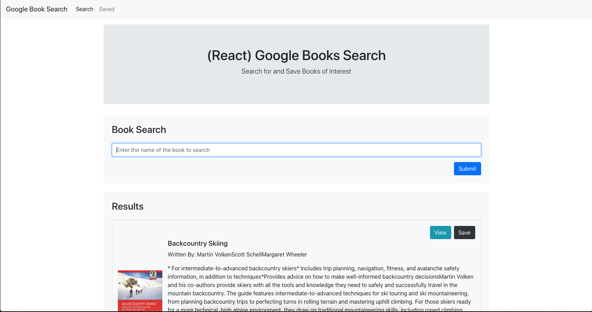

## Project Name

# Google Books Search

> This MERN stack application allows the user to search Google Books through their API. The user is able to view the book source or save the book information for future reference.

#### [View The Site](https://polar-ridge-98029.herokuapp.com/) - The project is live.

---

### Table of Contents

- [Description](#description)
- [Technologies](#technologies)
- [Installation](#installation)
- [How To Use](#how-to-use)
- [Test(s)](#tests)
- [Contributors](#contributors)
- [Questions](#questions)
- [License](#license)

---

## Description

This MERN (MongoDB, Express, React, Node) application allows the user to search Google Books through their API for related books to the search keyword.  The application will return all related books in a clean UI to the user.

The user is able to view the book source provided by Google.  The user is also able to save selected books to a saved book list.  The saved books are saved in a MongoDb and are retrieved by the application upon page load.

The user is able to delete saved books for the saved books list.

[Back To The Top](#project-name)

---

## Technologies

 

- React.js, Javascript, node.js, Express, MongoDB, Mongoose, HTML, Bootstrap

[Back To The Top](#project-name)

---

## Installation

Simply click the following link to load the application in your browser.

#### [View The Site](https://polar-ridge-98029.herokuapp.com/) - The project is live.

[Back To The Top](#project-name)

---
 
## How To Use

Once the application is loaded in the browser, simply click enter a search keyword in the input field and click the 'Search' button.

The application will return results.  Click either the 'View' button to view the book source or the 'Save' button to save the book to the saved book list.

Use the application navigation to select the 'Saved' page.

Click either the 'View' button to view the book source or the 'Delete' button to delete the book from the saved book list.

[Back To The Top](#project-name)

---

## Tests

There are no tests.

[Back To The Top](#project-name)

---

## Contributors

- Nate Valline

[Back To The Top](#project-name)

---

## Questions

Please contact the following for any questions.

  =>  contact@natevalline.com

[Back To The Top](#project-name)

---

## License

MIT License

Copyright (c) 2020 Nate Valline

Permission is hereby granted, free of charge, to any person obtaining a copy
of this software and associated documentation files (the "Software"), to deal
in the Software without restriction, including without limitation the rights
to use, copy, modify, merge, publish, distribute, sublicense, and/or sell
copies of the Software, and to permit persons to whom the Software is
furnished to do so, subject to the following conditions:

The above copyright notice and this permission notice shall be included in all
copies or substantial portions of the Software.

THE SOFTWARE IS PROVIDED "AS IS", WITHOUT WARRANTY OF ANY KIND, EXPRESS OR
IMPLIED, INCLUDING BUT NOT LIMITED TO THE WARRANTIES OF MERCHANTABILITY,
FITNESS FOR A PARTICULAR PURPOSE AND NONINFRINGEMENT. IN NO EVENT SHALL THE
AUTHORS OR COPYRIGHT HOLDERS BE LIABLE FOR ANY CLAIM, DAMAGES OR OTHER
LIABILITY, WHETHER IN AN ACTION OF CONTRACT, TORT OR OTHERWISE, ARISING FROM,
OUT OF OR IN CONNECTION WITH THE SOFTWARE OR THE USE OR OTHER DEALINGS IN THE
SOFTWARE.

[Back To The Top](#project-name)

---
    